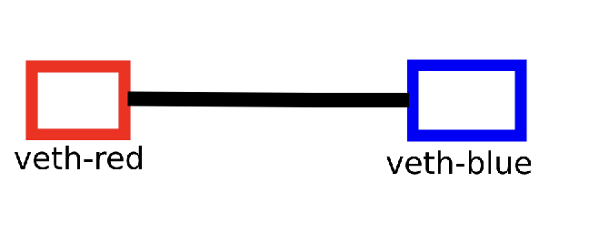
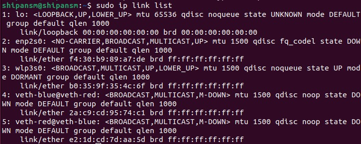
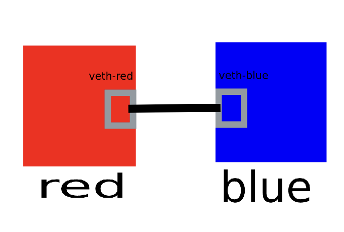
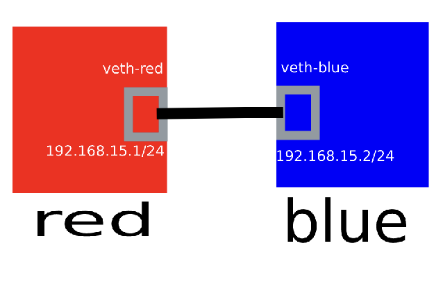
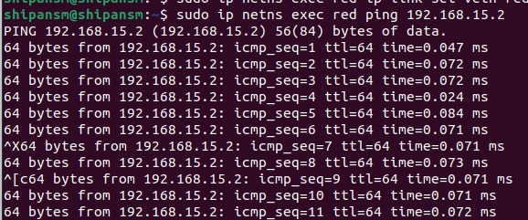

# Network Namespace
===============
A network namespace is a logical copy of the network stack from the host system. Network namespaces are useful for setting up containers or virtual environments. Each namespace has its own IP addresses, network interfaces, routing tables, and so forth.

# Namespace Create
In linux root namespace run following command
```bash
$ sudo ip netns add red
```
After run this command linux create a namespce name with red


Let's create another namespace:
```bash
$ sudo ip netns add blue
```

After run this command linux create a namespce name with blue


Now it's time to show all namespace we created. Run following command to show namespace

```bash
$ sudo ip netns list
```
Now create a virtual ethernet cable pair for connecting namespaces

```bash
$ sudo ip link add veth-red type veth peer veth-blue
```


Show vetch link list
```bash
$ sudo ip link list
```


Now veth cable connet to namespace

```bash
$ sudo ip link set veth-red netns red

$ sudo ip link set veth-blue netns blue
```



We are almost done. Now assign ip address with in each namespace

```bash
$ sudo ip netns exec red ip addr add 192.168.15.1/24 dev veth-red
$ sudo ip netns exec red ip link set veth-red up

$ sudo ip netns exec blue ip addr add 192.168.15.2/24 dev veth-blue
$ sudo ip netns exec blue ip link set veth-blue up
```


Now ping from one namespace to another namespace.

```bash
$ sudo ip netns exec red ping 192.168.15.2
```
